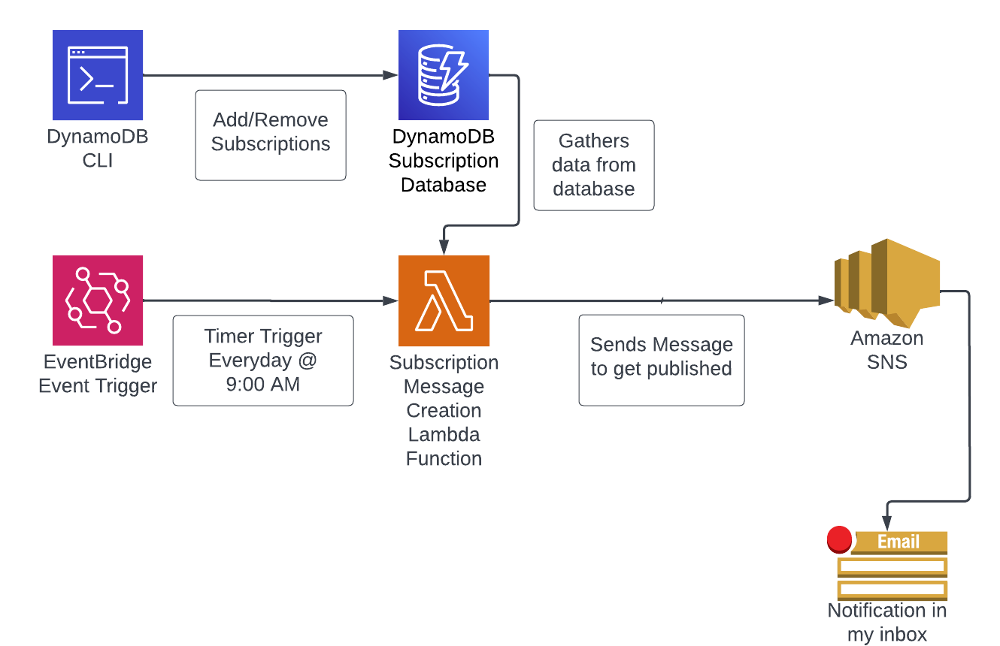

# AWS Subscription Project

## Description

This is designed as a way for me to keep track of all my subscriptions **reliably** before a company takes money from my account.

The code that I used for my AWS introductory project

- This includes...
  - The CLI I built to interact with the Dynamo database
  - The code invoked by the AWS Lambda function I have in production

### Operation Diagram

- The **CLI** is the way I control what subscriptions are in the database
- **DynamoDB** is the database of choice 
- The **Event Bridge** triggers my **Lambda function** at a specified time that I set
- The Lambda function draws information from my database and calculates if there's a subscription payment that I have in the near future
  - Notifications will be sent to Amazon SNS when there's a subscription due today, tomorrow, or 3 days from the current date
- In SNS, there's a topic that I have an email subscribed to so that I can get my notifications on upcoming subscriptions
